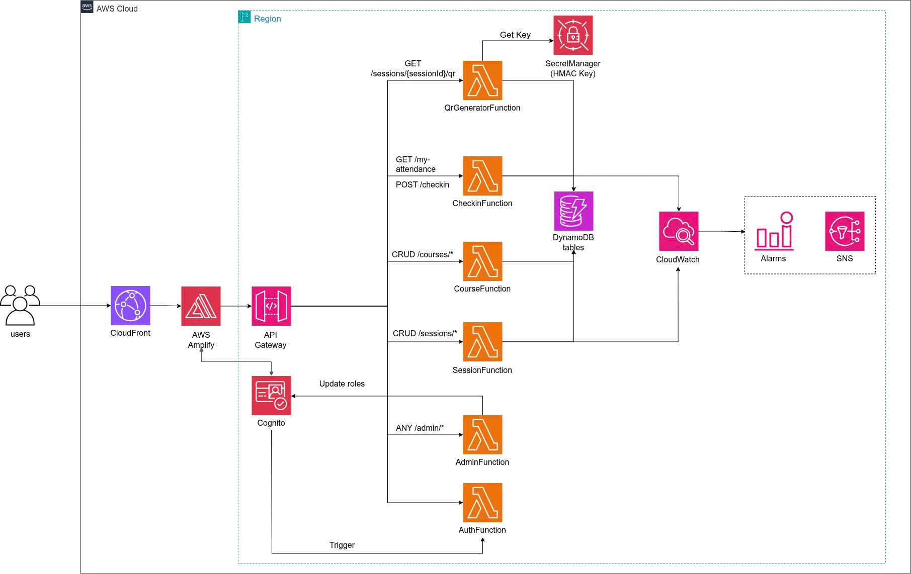

### 1. Bối cảnh & Bài toán

Trong môi trường giáo dục đại học, đặc biệt là tại các lớp học có sĩ số đông (từ 50 đến 100+ sinh viên), việc điểm danh truyền thống bằng cách gọi tên tiêu tốn rất nhiều thời gian, làm gián đoạn quá trình giảng dạy và dễ xảy ra tình trạng điểm danh hộ.

**Hệ thống BK-Sync** được ra đời nhằm giải quyết bài toán này. Khách hàng mục tiêu của hệ thống là:
- **Trường học/Cơ sở đào tạo:** Cần hệ thống quản lý chuyên cần chính xác, chống gian lận.
- **Giảng viên:** Cần tiết kiệm thời gian điểm danh để tập trung vào chuyên môn.
- **Sinh viên:** Cần một quy trình điểm danh nhanh chóng, tiện lợi bằng thiết bị di động.

### 2. Ý tưởng giải pháp

Giải pháp của chúng ta là xây dựng một hệ thống **Điểm danh bằng mã QR thời gian thực (Real-time QR Attendance)** trên nền tảng điện toán đám mây.
- Giảng viên sẽ mở một phiên điểm danh trên website. Mã QR sẽ được hiển thị trên máy chiếu và liên tục làm mới (refresh) mỗi vài giây để chống việc sinh viên chụp ảnh gửi cho bạn bè ở nhà.
- Sinh viên sử dụng điện thoại thông minh quét mã QR để xác nhận sự có mặt.

### 3. Mục tiêu cụ thể (Outputs)

1. **Giao diện Dashboard (Frontend):** 
   - Dành cho Giảng viên: Tạo lớp học, mở phiên điểm danh, hiển thị QR code thay đổi liên tục, xem báo cáo thống kê và xuất dữ liệu điểm danh ra file Excel (file có thể cho biết những sinh viên nào dùng chung một thiết bị).
   - Dành cho Sinh viên: Xem lịch sử điểm danh của bản thân.
2. **Hệ thống API Serverless (Backend):**
   - Xử lý xác thực người dùng, sinh mã QR, xác thực token QR và ghi nhận trạng thái điểm danh.
3. **Cảnh báo (Alerting & Monitoring):**
   - Theo dõi sức khỏe hệ thống và gửi cảnh báo qua SNS Topic nếu hệ thống gặp sự cố (ví dụ: hàm điểm danh bị lỗi liên tục).

### 4. Sơ đồ kiến trúc 

Hệ thống được thiết kế theo mô hình **Serverless 100%** trên AWS, giúp tối ưu chi phí và tự động mở rộng (Auto-scaling).

