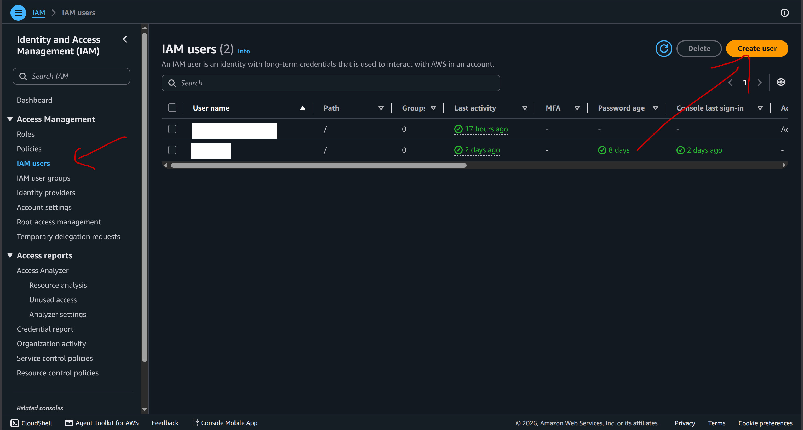
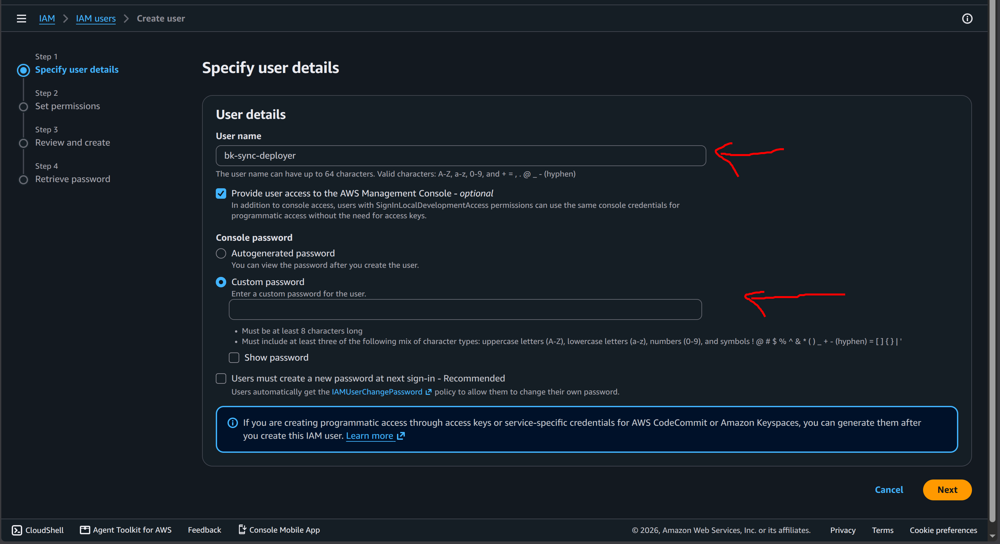
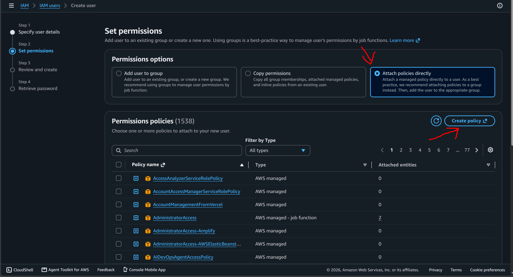
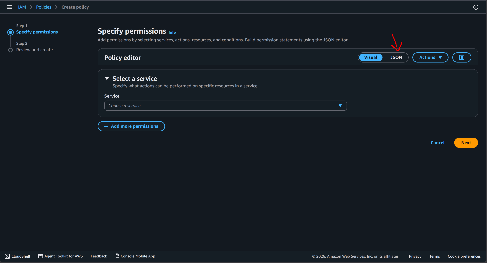
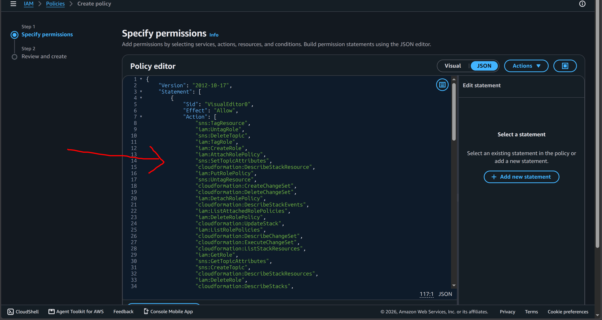
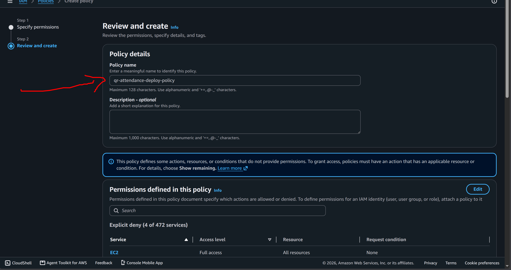
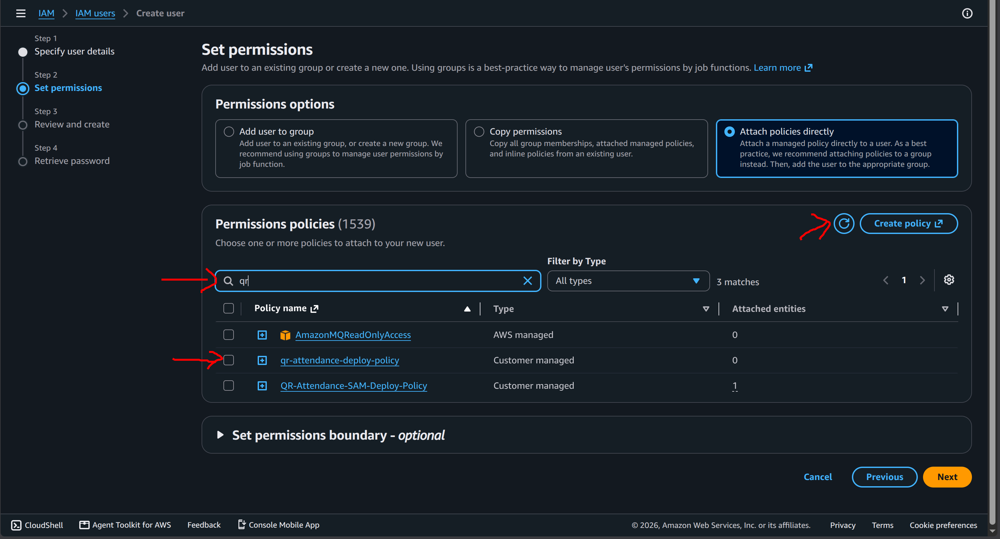

### 1. Tài khoản AWS & Quyền IAM

Để đảm bảo an toàn khi triển khai hệ, ta không sử dụng tài khoản Root. Hãy tạo một tài khoản IAM User mới và cấp quyền truy cập AWS Management Console.

**Các bước tạo IAM User:**
1. Đăng nhập vào AWS Console bằng tài khoản Root.
2. Truy cập dịch vụ **IAM**, chọn **Users** -> **Create user**.

3. Đặt tên User (VD: `bk-sync-deployer`).
4. Tích chọn **Provide user access to the AWS Management Console**.
5. Có thể tùy chọn **Auto-generated password** hoặc **Custom password**.Sau đó bấm Next 

6. Trong phần **Set permissions**, chọn **Attach policies directly**, sau đó bấm **Create policy**.

7. Trình duyệt sẽ mở một tab mới. Chuyển sang tab **JSON**

8. Xóa nội dung cũ đi, copy và dán toàn bộ đoạn mã JSON phân quyền (đã tối ưu Least Privilege) sau đây:

```json
{
    "Version": "2012-10-17",
    "Statement": [
        {
            "Sid": "AllowAWSLoginAction",
            "Effect": "Allow",
            "Action": [
                "signin:AuthorizeOAuth2Access",
                "signin:CreateOAuth2Token"
            ],
            "Resource": "*"
        },
        {
            "Sid": "VisualEditor0",
            "Effect": "Allow",
            "Action": [
                "sns:TagResource",
                "iam:UntagRole",
                "sns:DeleteTopic",
                "iam:TagRole",
                "iam:CreateRole",
                "iam:AttachRolePolicy",
                "sns:SetTopicAttributes",
                "cloudformation:DescribeStackResource",
                "iam:PutRolePolicy",
                "sns:UntagResource",
                "cloudformation:CreateChangeSet",
                "cloudformation:DeleteChangeSet",
                "iam:DetachRolePolicy",
                "cloudformation:DescribeStackEvents",
                "iam:ListAttachedRolePolicies",
                "iam:DeleteRolePolicy",
                "cloudformation:UpdateStack",
                "iam:ListRolePolicies",
                "cloudformation:DescribeChangeSet",
                "cloudformation:ExecuteChangeSet",
                "cloudformation:ListStackResources",
                "iam:GetRole",
                "sns:GetTopicAttributes",
                "sns:CreateTopic",
                "cloudformation:DescribeStackResources",
                "iam:DeleteRole",
                "cloudformation:DescribeStacks",
                "cloudformation:CreateStack",
                "cloudformation:DeleteStack",
                "cloudformation:GetTemplate",
                "iam:UpdateRole",
                "iam:GetRolePolicy",
                "cloudformation:ListChangeSets"
            ],
            "Resource": [
                "arn:aws:iam::*:role/qr-attendance-backend-dev-*",
                "arn:aws:iam::*:role/*-qr-attendance-backend-dev-*",
                "arn:aws:sns:*:*:QRAttendanceAlarmTopic*",
                "arn:aws:cloudformation:*:aws:transform/Serverless-2016-10-31",
                "arn:aws:cloudformation:*:*:stack/qr-attendance-backend-dev*/*",
                "arn:aws:cloudformation:*:*:stack/aws-sam-cli-managed-default/*"
            ]
        },
        {
            "Sid": "ScopedResources",
            "Effect": "Allow",
            "Action": [
                "s3:*",
                "dynamodb:*",
                "secretsmanager:*",
                "lambda:*",
                "logs:DeleteLogGroup",
                "logs:PutRetentionPolicy",
                "logs:CreateLogDelivery",
                "cloudwatch:PutMetricAlarm",
                "cloudwatch:DeleteAlarms"
            ],
            "Resource": [
                "arn:aws:s3:::aws-sam-cli-managed-default-*",
                "arn:aws:dynamodb:*:*:table/qr-attendance-backend-dev-*",
                "arn:aws:secretsmanager:*:*:secret:*",
                "arn:aws:lambda:*:*:function:qr-attendance-backend-dev-*",
                "arn:aws:lambda:*:*:layer:*",
                "arn:aws:logs:*:*:log-group:/aws/lambda/qr-attendance-backend-dev-*",
                "arn:aws:cloudwatch:*:*:alarm:qr-attendance-backend-dev-*"
            ]
        },
        {
            "Sid": "GlobalResources",
            "Effect": "Allow",
            "Action": [
                "cloudformation:ListStacks",
                "cloudformation:GetTemplateSummary",
                "cloudformation:ValidateTemplate",
                "logs:DescribeLogGroups",
                "logs:DescribeLogStreams",
                "logs:FilterLogEvents",
                "logs:GetLogEvents",
                "logs:CreateLogGroup",
                "cloudwatch:DescribeAlarms",
                "cloudwatch:DescribeAlarmsForMetric",
                "cloudwatch:GetMetricData",
                "cloudwatch:GetMetricStatistics",
                "cloudwatch:ListMetrics",
                "apigateway:*",
                "cognito-idp:*",
                "amplify:*",
                "secretsmanager:GetRandomPassword"
            ],
            "Resource": "*"
        },
        {
            "Sid": "VisualEditor2",
            "Effect": "Allow",
            "Action": "iam:PassRole",
            "Resource": "arn:aws:iam::*:role/qr-attendance-backend-dev-*",
            "Condition": {
                "StringEquals": {
                    "iam:PassedToService": [
                        "lambda.amazonaws.com",
                        "apigateway.amazonaws.com"
                    ]
                }
            }
        },
        {
            "Sid": "VisualEditor4",
            "Effect": "Deny",
            "Action": [
                "rds:*",
                "redshift:*",
                "sagemaker:*",
                "ec2:*"
            ],
            "Resource": "*"
        }
    ]
}

```

9. Bấm **Next**, đặt tên Policy (VD: `qr-attendance-deploy-policy`), kéo xuống và bấm **Create policy**.

10. Quay lại tab tạo User ban đầu, bấm nút **Refresh** (biểu tượng mũi tên xoay tròn), tìm và tích chọn Policy vừa tạo. Sau đó bấm Create user 

11. Hoàn tất tạo User và lưu lại tài khoản/mật khẩu đăng nhập. Đăng nhập vào tài khoản IAM mà đã tạo. Sau khi đăng nhập cần chỉnh region về ap-southeast-1 để có thể triển khai được.

### 2. Cài đặt Công cụ (CLI Tools)

Đảm bảo máy tính của bạn đã cài đặt các công cụ sau:
- **Git**: Dùng để clone mã nguồn.
Cách cài đặt: [https://git-scm.com/downloads](https://git-scm.com/downloads)
- **Node.js (v20+)**: Môi trường chạy code.
Cách cài đặt: [https://nodejs.org/en/download](https://nodejs.org/en/download)
- **AWS CLI**: Công cụ giao tiếp với AWS.
Cách cài đặt: [https://docs.aws.amazon.com/cli/latest/userguide/getting-started-install.html](https://docs.aws.amazon.com/cli/latest/userguide/getting-started-install.html)
- **AWS SAM CLI**: Công cụ đóng gói và triển khai Serverless.
Cách cài đặt: [https://docs.aws.amazon.com/serverless-application-model/latest/developerguide/serverless-sam-cli-install.html](https://docs.aws.amazon.com/serverless-application-model/latest/developerguide/serverless-sam-cli-install.html)

