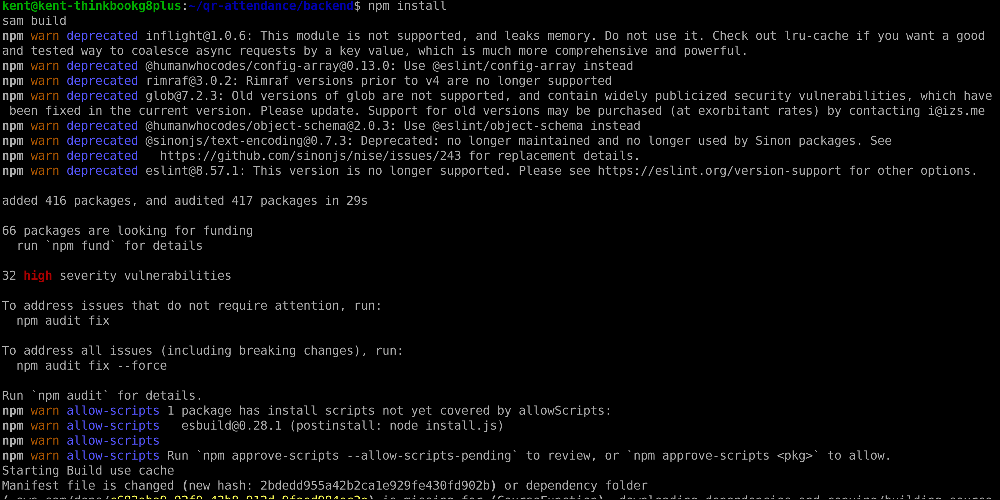
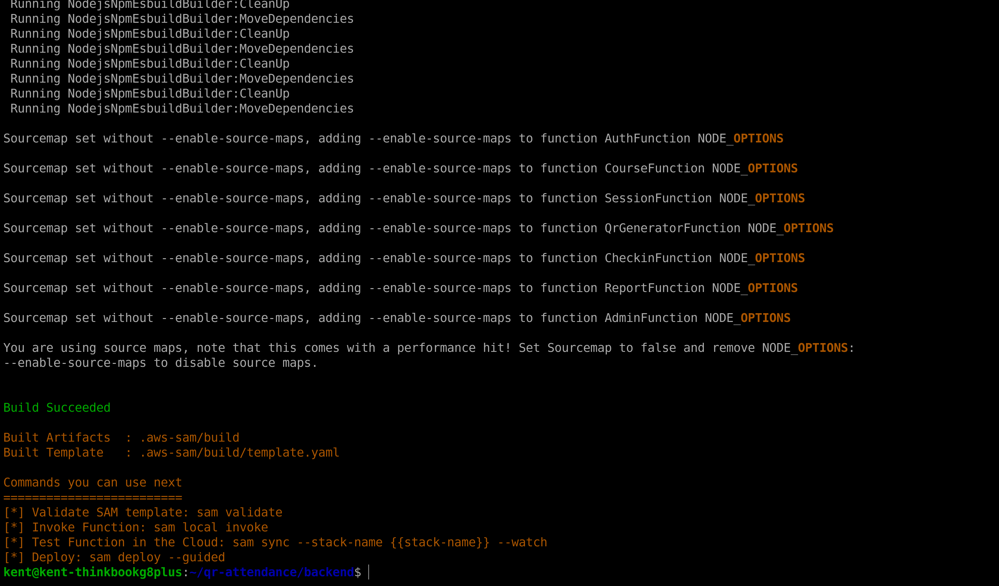
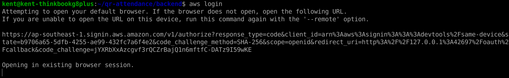
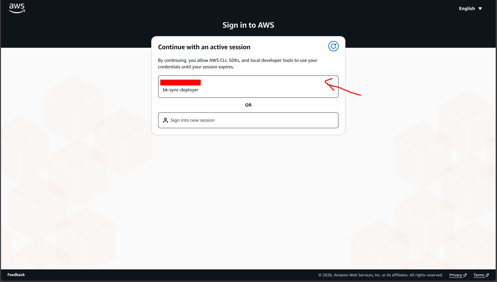
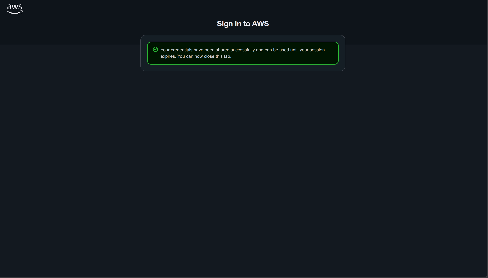
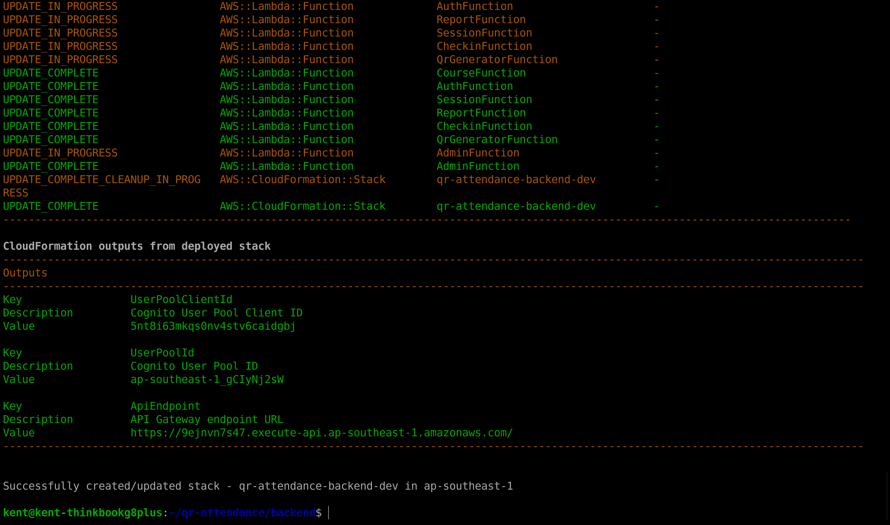
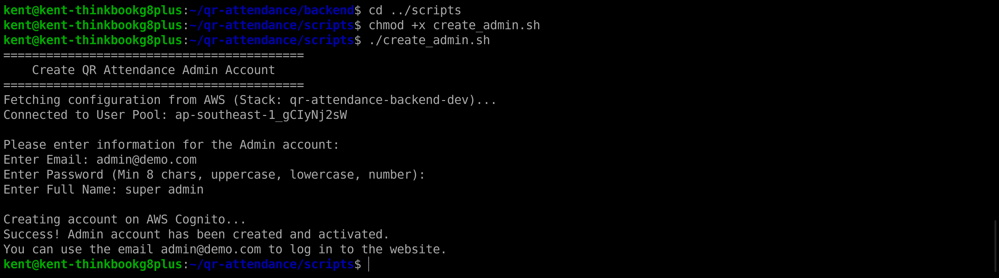

### 1. Clone Source Code

Source code link:      
https://github.com/kentdoan/qr-attendance

Open your Terminal and clone the repository:
```bash
git clone https://github.com/kentdoan/qr-attendance.git
cd qr-attendance/backend
```

### 2. Build the Application

Use `npm install` to download dependencies first, then use AWS SAM to bundle the Lambda code using ESBuild:
```bash
npm install
sam build
```




### 3. Deploy to AWS

Before deploying, ensure you have logged in and linked your Terminal with your AWS account:
```bash
aws login
```




Then, run the following command to deploy the infrastructure to AWS (CloudFormation will automatically provision Lambda, API Gateway, DynamoDB, etc.):
```bash
sam deploy --guided
```

The system will prompt you for configuration. Answer as follows:
- **Stack Name**: `qr-attendance-backend-dev`
- **AWS Region**: `ap-southeast-1`
- **Confirm changes before deploy**: `y`
- **Allow SAM CLI IAM role creation**: `y`
- **Disable rollback**: `n`
- **Save arguments to configuration file**: `y`
- **SAM configuration file**: Press `Enter` to keep the default `samconfig.toml`
- **SAM configuration environment**: Press `Enter` to keep the default `default`
- Deploy this changeset? : y

Wait about 2-3 minutes for the deployment to finish.



### 4. Save Configuration Outputs

Upon successful deployment, the Terminal will print an **Outputs** table. You **MUST SAVE** the following 3 values to configure the Frontend in the next step:
- `ApiEndpoint` (The API Gateway URL)
- `UserPoolId` (Cognito User Pool ID)
- `UserPoolClientId` (Cognito App Client ID)

---

### 5. Create an Admin Account

To log in and create classes, you need an Admin account. We have provided a script that automatically connects to AWS to create this account for you.

Run the following command in your Terminal (ensure you are in the `qr-attendance/backend` directory):
```bash
cd ../scripts
chmod +x create_admin.sh
./create_admin.sh
```

The system will automatically find the AWS connection and prompt you for an Email, Password, and Full Name.



When the screen says "Success!", you can use this account to log in to the website in the next section.
