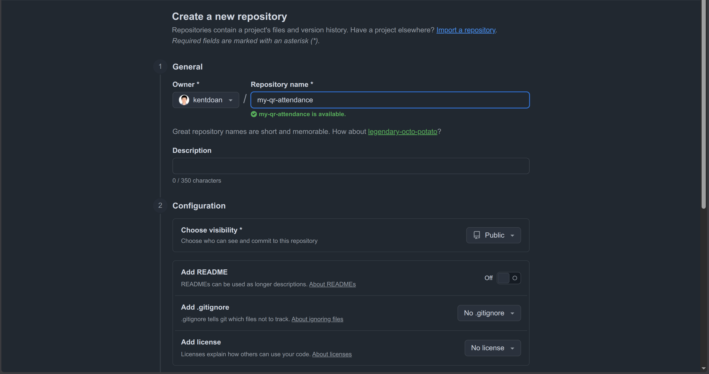
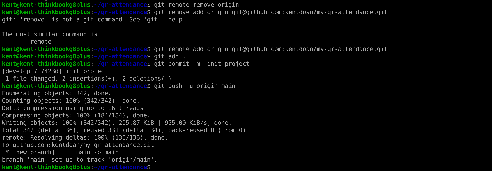
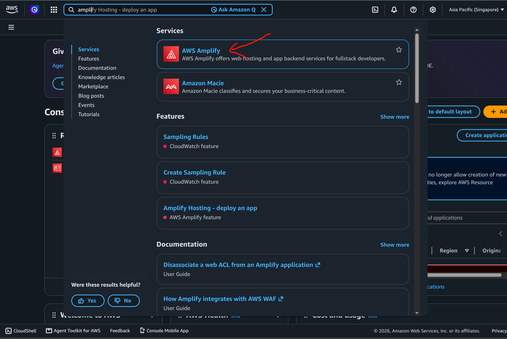
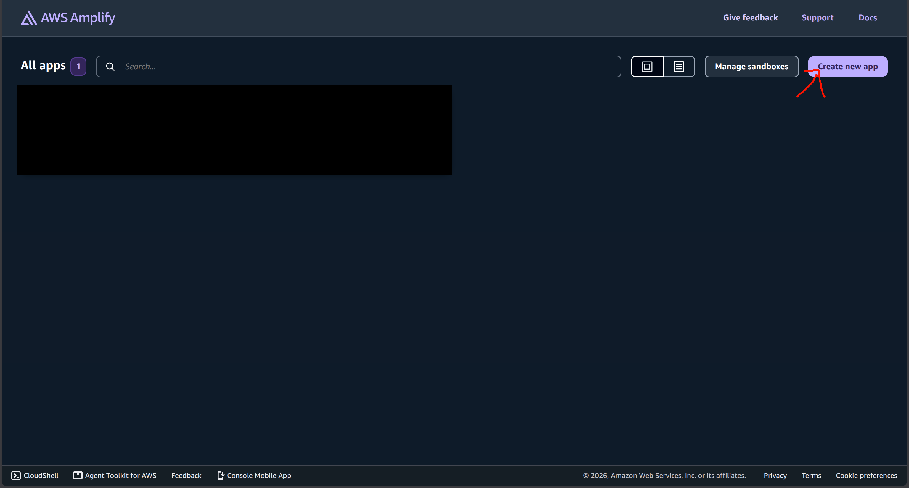
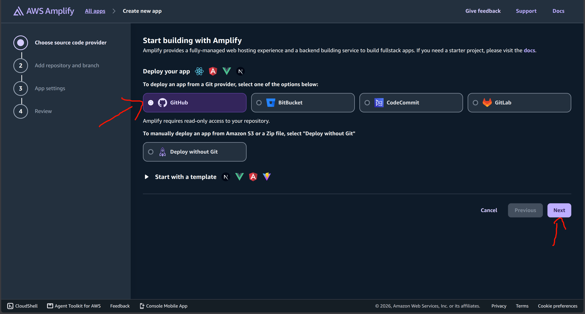
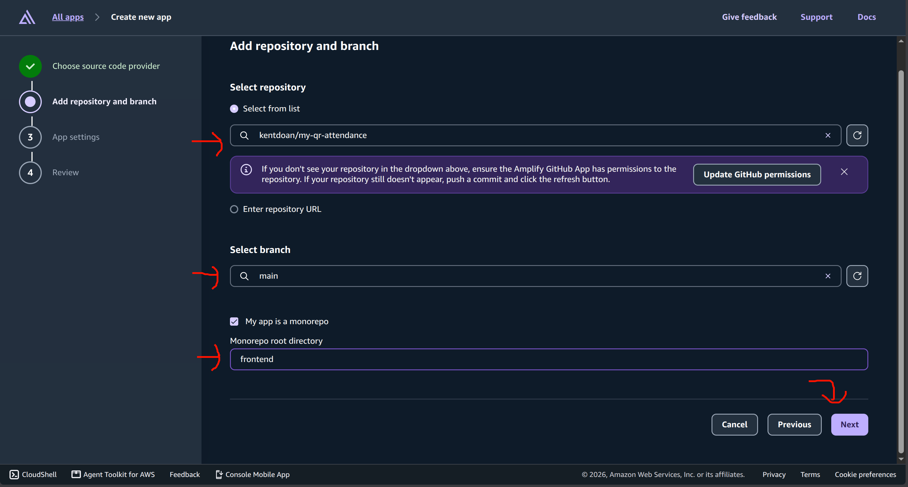
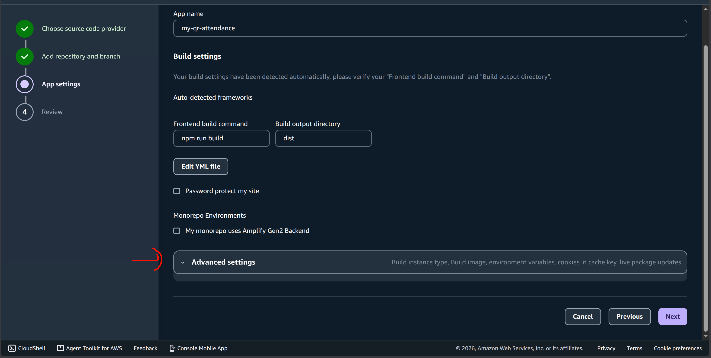
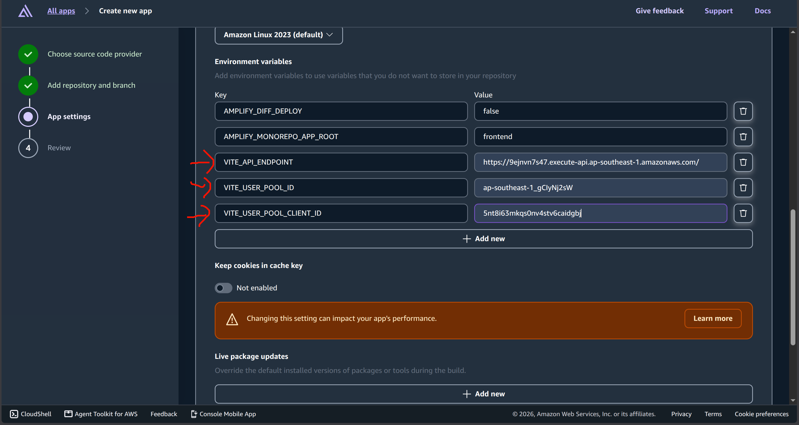
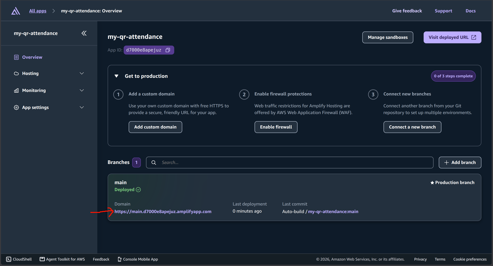

### 1. Đưa mã nguồn lên GitHub

Vì bạn đang dùng mã nguồn được clone từ kho chứa gốc (không có quyền push code), bạn cần tạo một kho chứa (repository) của riêng mình trên GitHub để AWS Amplify có thể liên kết và tự động lấy code về. 

Lưu ý: Để đảm bảo tính bảo mật (Best Practice), hệ thống đã cấu hình sẵn file `.gitignore` để tuyệt đối **không** đưa các thông số nhạy cảm lên GitHub.

1. Truy cập [GitHub](https://github.com/), đăng nhập và tạo một Repository mới (New repository) có tên tùy ý (ví dụ: `my-qr-attendance`). **Lưu ý: Không tích chọn thêm file README hay .gitignore.**

2. Sau khi tạo xong, copy đường link của Repo đó.
3. Mở Terminal, hãy lùi lại về thư mục gốc của dự án (`qr-attendance`) và thực hiện cấu hình lại đường dẫn git (lưu ý: đường dẫn trong ảnh có thể khác của bạn vì người trong ảnh đã cấu hình Git bằng SSH thay vì HTTP):

```bash
cd ..
git remote remove origin
git remote add origin <Link-GitHub-Repo-Của-Bạn>
git add .
git commit -m "init project"
git push -u origin main
```




### 2. Triển khai lên AWS Amplify Hosting (CI/CD)

Để giúp hệ thống có thể truy cập được từ Internet, chúng ta sẽ đẩy Frontend lên AWS Amplify.

1. Mở AWS Console, tìm dịch vụ **AWS Amplify**.

2. Chọn **Create new app**

3. Chọn **GitHub** và cấp quyền kết nối.

4. Chọn Repository chứa mã nguồn của bạn và nhánh `main`. **Lưu ý quan trọng:** Hãy tích chọn ô **Connecting a monorepo? Pick a folder** và điền chữ `frontend` vào ô trống bên dưới (vì code giao diện của dự án nằm trong thư mục này). Sau đó bấm **Next**.

5. Tại màn hình **App settings**,mở rộng phần **Advanced settings** (Cài đặt nâng cao).

6. Ở mục **Environment variables** (Biến môi trường), hãy lần lượt nhấn "Add variable" để thêm 3 thông số mà bạn đã lưu lại ở phần Triển khai Backend:
   - Biến 1: Name = `VITE_API_ENDPOINT`, Value = `https://xxxx...`
   - Biến 2: Name = `VITE_USER_POOL_ID`, Value = `ap-southeast-1_xxxx...`
   - Biến 3: Name = `VITE_USER_POOL_CLIENT_ID`, Value = `xxxx...`


7. Bấm **Next** và cuối cùng bấm **Save and deploy**.

### 3. Hoàn tất & Kiểm tra

Quá trình Build trên Amplify sẽ mất khoảng 2 phút. Khi hoàn tất, Amplify sẽ cung cấp cho bạn một đường link HTTPS miễn phí (ví dụ: `https://main.xxxxxxxxx.amplifyapp.com`).



Hãy bấm vào đường link đó, bạn sẽ thấy giao diện Đăng nhập của BK-Sync!
