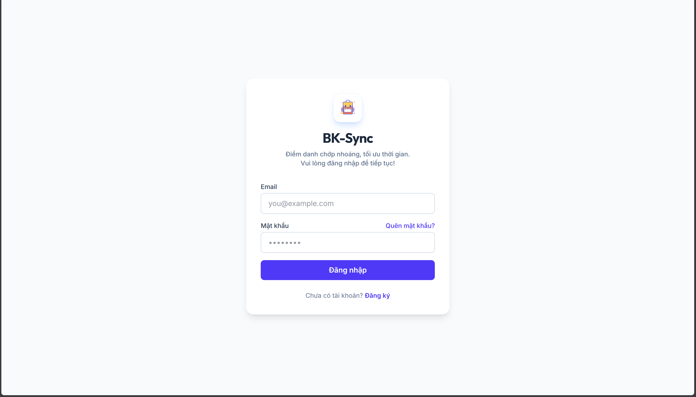
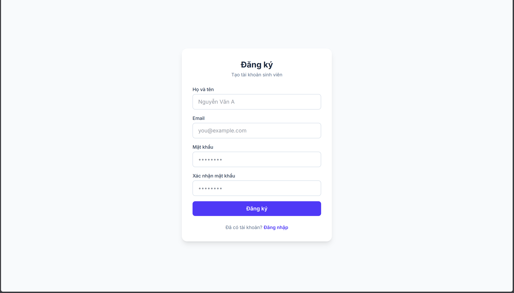
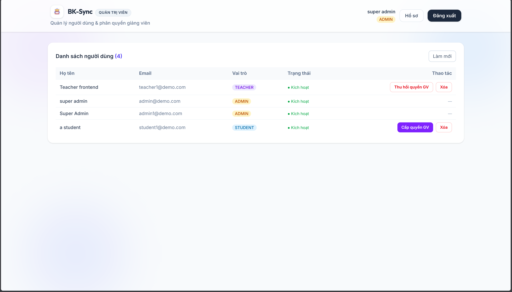
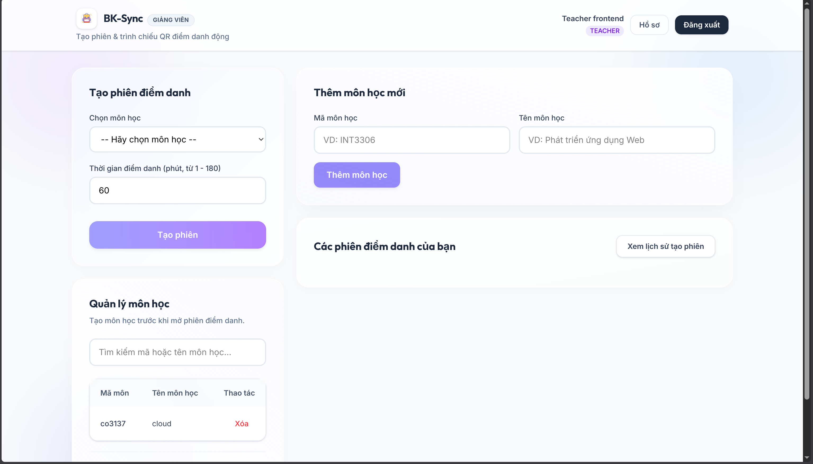
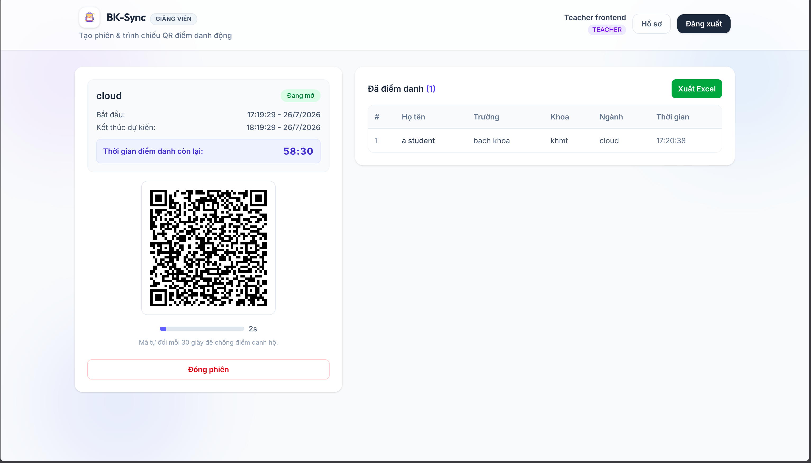
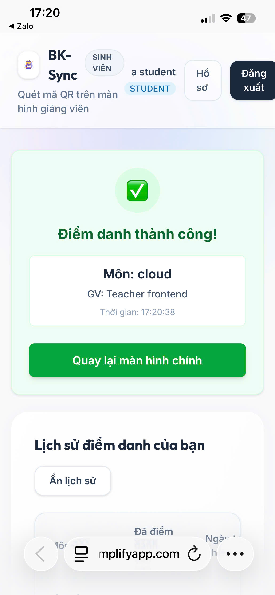
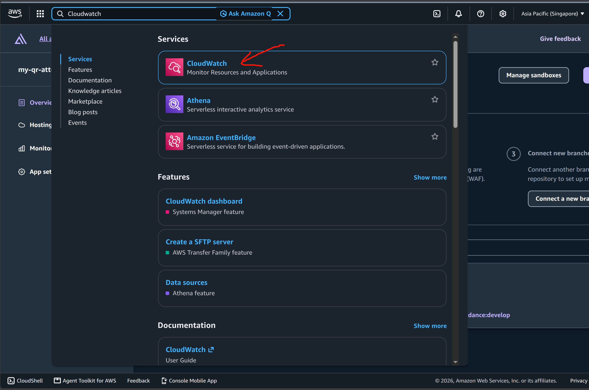
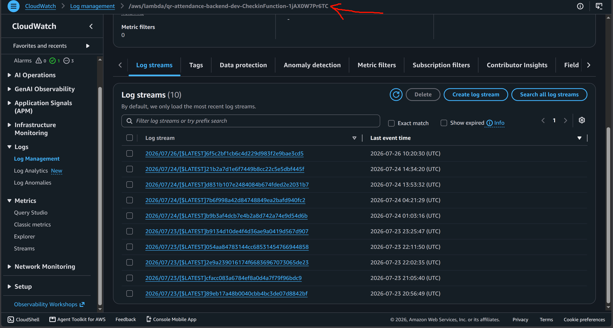
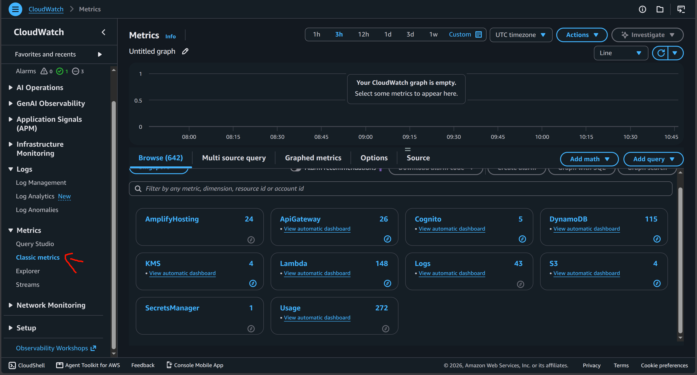

### 1. Giao diện đăng ký/đăng nhập & Admin 

**Đăng ký/Đăng nhập**

**Giao diện Admin**

### 2. Kiểm thử 

**Teacher tạo phiên điểm danh**
- Đăng nhập bằng tài khoản Teacher.
- Bấm **Thêm môn học** để tạo môn học mới.

- Trong chi tiết môn học, bấm **Tạo phiên**.
- Màn hình sẽ hiển thị mã QR. Hãy để ý mã QR này sẽ **liên tục thay đổi** 
mỗi vài giây để chống gian lận!

- Sinh viên quét mã điểm danh thành công sẽ hiện lên ở **Danh sách điểm danh**
bên phải. có thể xuất ra file Excel danh sách này.

**Student quét QR (Check-in)**
- Sử dụng điện thoại truy cập vào trang web, đăng nhập bằng tài khoản Student.
- Bấm vào **Bắt đầu quét** để dùng camera quét mã QR 
- Màn hình báo thành công.

### 2. Xem Log và Metrics (Logging & Monitoring)

Để đảm bảo hệ thống vận hành trơn tru, chúng ta sẽ kiểm tra Log.

**Xem Log Lambda:**
1. Mở AWS Console -> **CloudWatch** -> **Log Management**.

2. Tìm log group của hàm `/aws/lambda/qr-attendance-backend-dev-CheckinFunction...`
3. Bạn sẽ thấy các dòng log ghi lại quá trình sinh viên quét QR hợp lệ.

**Kiểm tra Metrics:**
1. Mở AWS Console -> **CloudWatch** -> **Metrics** -> **Classic metrics** 
2. Tại đây có thể xem những thông số liên quan đến hạ tầng

