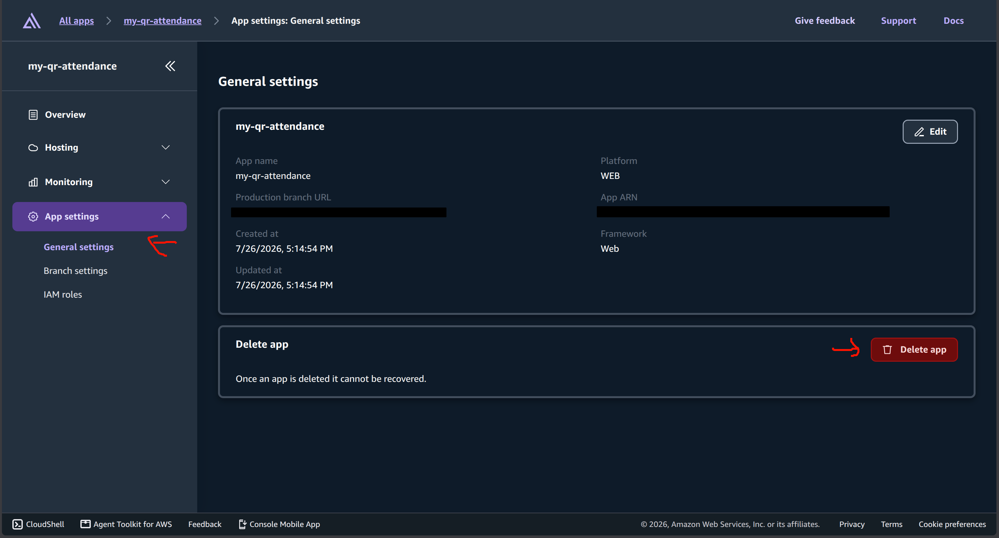
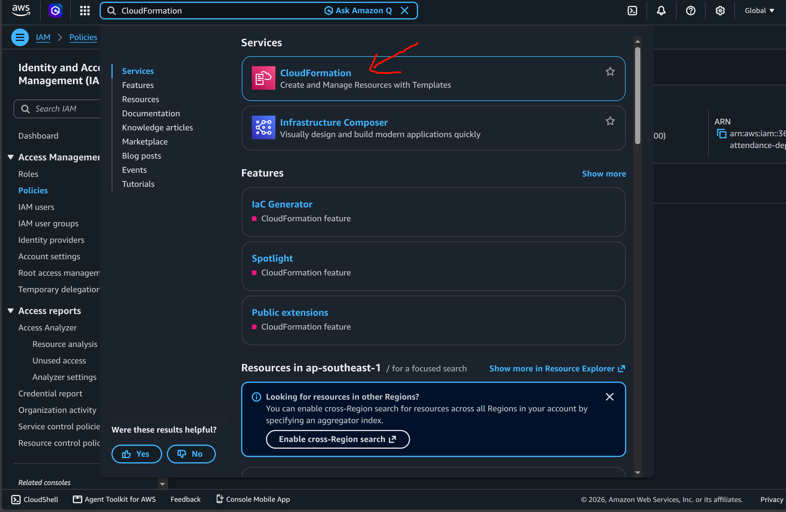
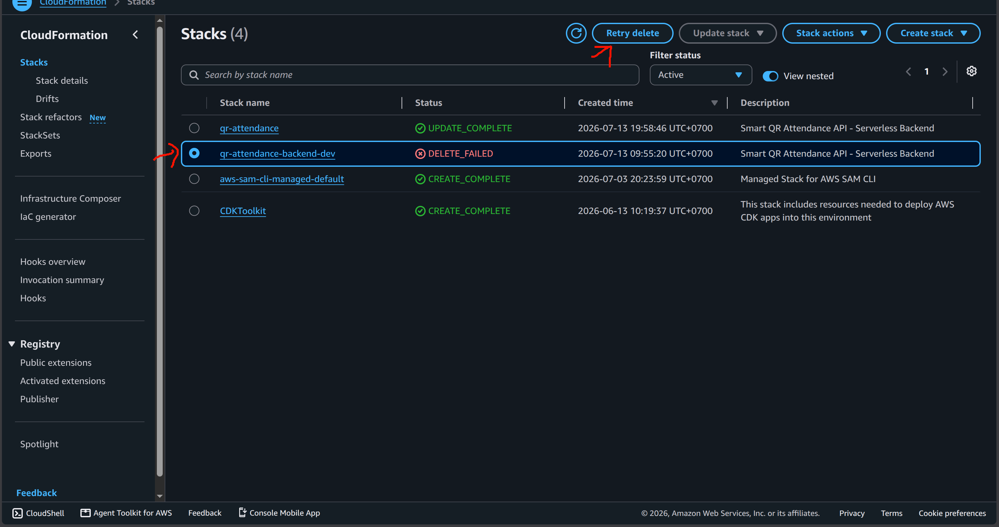
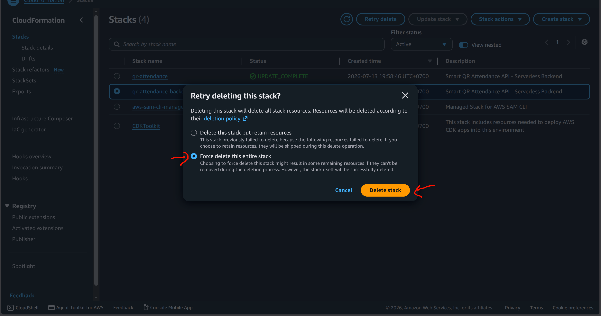

### 1. Delete Frontend Hosting (AWS Amplify)

You should delete the frontend interface first. 
1. Open AWS Console -> search for **AWS Amplify**.
2. Select the BK-Sync app you created.
3. In the side menu, click **App settings** -> **General settings**.
4. Scroll to the bottom and click **Delete app** to delete it.


### 2. Delete Backend Infrastructure (AWS SAM)

To avoid being charged by AWS, you must remove all created Lambdas, API Gateways, DynamoDB tables, etc.

**Method 1: Delete via CLI (Recommended)**
Open Terminal (while in the `backend` directory) and run the command:
```bash
sam delete
```
Confirm with `y` for all questions. CloudFormation will automatically find and remove everything.

**Method 2: Delete via Web Console (Fallback for errors)**
Sometimes deleting via CLI fails (because AWS Secrets Manager locks the Secret with a 30-day protection window). If you encounter a `DELETE_FAILED` error for the `HmacSecretV2` resource, do the following:
1. Open AWS Console -> search for **CloudFormation**.

2. Click on the `qr-attendance-backend-dev` stack, and select **Delete** (or **Retry delete** if it previously failed).

3. A prompt will appear. Select **Force delete this entire stack**, then click **Delete stack**.


The system is now completely cleaned up!
